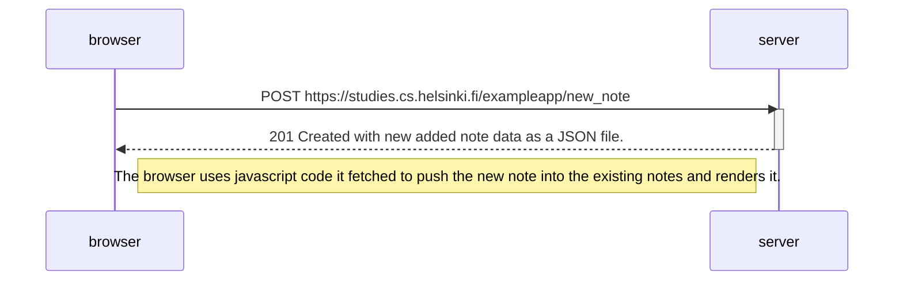

```mermaid
sequenceDiagram
  participant browser
  participant server
  
  browser->>server: POST https://studies.cs.helsinki.fi/exampleapp/new_note
  activate server
  server-->>browser: 201 Created with new added note data as a JSON file.
  deactivate server
  Note right of browser: The browser uses javascript code it fetched to push the new note into the existing notes and renders it.
```
